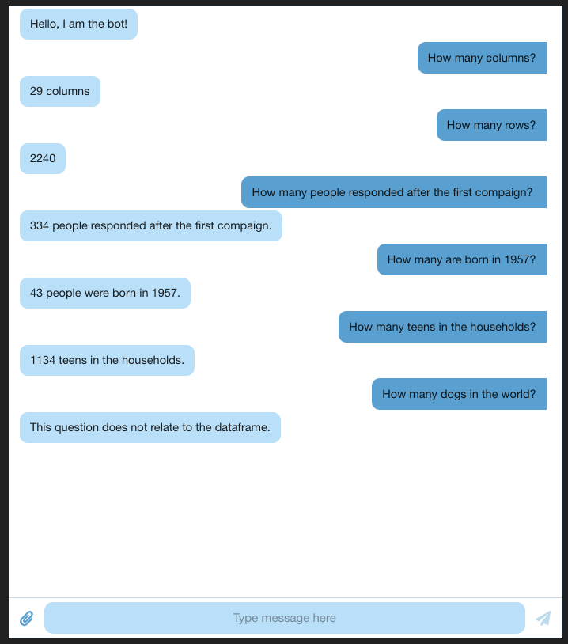

# React + Vite

This template provides a minimal setup to get React working in Vite with HMR and some ESLint rules.

Currently, two official plugins are available:

- [@vitejs/plugin-react](https://github.com/vitejs/vite-plugin-react/blob/main/packages/plugin-react/README.md) uses [Babel](https://babeljs.io/) for Fast Refresh
- [@vitejs/plugin-react-swc](https://github.com/vitejs/vite-plugin-react-swc) uses [SWC](https://swc.rs/) for Fast Refresh

This is a AI chatbot, made with React+Vite, python, langchain and OpenAI.

- constants.py is where API key is being stored, please add the key there for the application to work
- chatgpt.py the AI is handled and the ml_project1_data.csv file is being fed into the AI
- App.jsx app file that handles the front end, using @chatscope/chat-ui-kit-react

to run this:
*make sure the API key was added*
```
run python3 chatgpt.py
#then on a new terminal
run npm start

```

After that you will be taken to the bot interface.

To interact with the bot just type in the questions such as:
"How many people were born in 1957?"
"How many teens in the household?"


